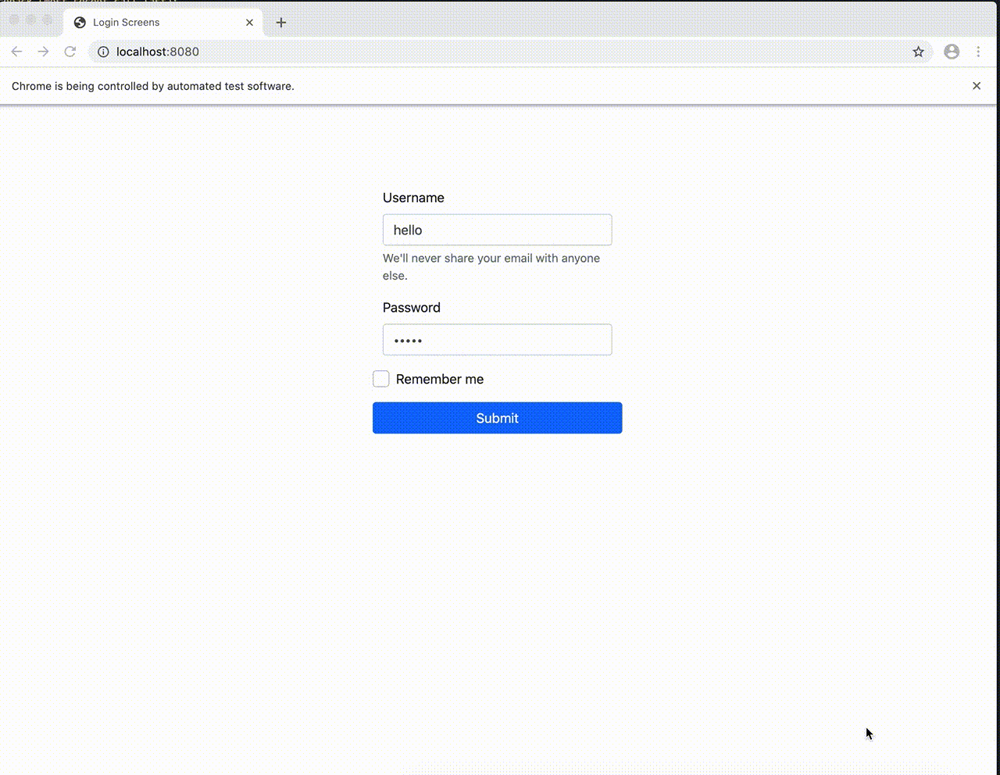

# Python automation
Web Automation using python

# Dependencies

[Python (3.7)](https://www.python.org/downloads/release/python-379/)

[Selenium](https://pypi.org/project/selenium/)

[Chrome Webdriver](https://github.com/SeleniumHQ/selenium/wiki/ChromeDriver)

[HTTP Server](https://docs.python.org/3/library/http.server.html)

# How to run

* Run http server using `python -m http.server 8080` command in `/static` directory
* Run python script using `python index.py` command

Note: same username and password will take you to success page otherwise failure page

